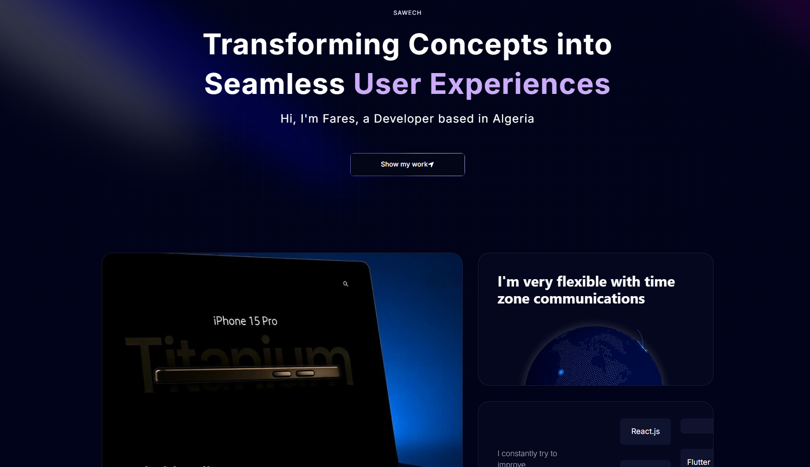

<div align="center">
  <h1>🚀 Fares Sawech - Portfolio Website</h1>
  <p><strong>Transforming Concepts into Seamless User Experiences</strong></p>
  
  <p>
    <a href="https://sawech.pages.dev/" target="_blank">
      
    </a>
  </p>
</div>

---

## 📸 Preview

<div align="center">
  
  <br/>
  
</div>

---

## 👨‍💻 About This Project

A modern, interactive portfolio website built with **Next.js 15** and **TypeScript**, showcasing my skills, projects, and experience as a Full Stack Developer. Features stunning 3D animations, smooth scrolling effects, and a fully responsive design.

**Live Website:** [sawech.pages.dev](https://sawech.pages.dev/)

---

## ✨ Features

- 🎨 **Modern UI/UX** - Clean, professional design with smooth animations
- 🌓 **Dark Theme** - Eye-friendly dark mode interface
- 📱 **Fully Responsive** - Optimized for all devices (mobile, tablet, desktop)
- 🎭 **3D Animations** - Interactive Three.js elements and GSAP animations
- ⚡ **Fast Performance** - Built with Next.js 15 for optimal speed
- 🎯 **Project Showcase** - Detailed case studies of my best work
- 💼 **Work Experience** - Professional background and achievements
- 📧 **Contact Form** - Easy way to get in touch

---

## 🛠️ Tech Stack

### Frontend


### Animation & 3D


### Backend & Tools


### Deployment


---

## 🎯 Featured Projects

### 1. 🎬 Animated iPhone 3D
Recreated the Apple iPhone 15 Pro website with stunning 3D models and GSAP animations.
- **Tech:** React, Three.js, GSAP, Tailwind CSS
- **Features:** 3D iPhone model, smooth scroll animations, responsive design

### 2. 🤖 Brainwave - AI Chat Application
Conceptual AI chatting interface designed to showcase modern UI/UX principles.
- **Tech:** React, GSAP, Tailwind CSS
- **Features:** Modern UI, responsive design, interactive elements

### 3. 📄 Resumind - AI-Powered Resume Builder
AI-powered platform for creating professional resumes with smart suggestions.
- **Tech:** React router, TailwindCss, Vite
- **Features:** AI resume generation, real-time preview, export to PDF

### 4. 🎓 Edusity - Educational Platform
Modern educational platform concept for the future of learning.
- **Tech:** React
- **Features:** Programs offered, Testimonials,  

---

## 🚀 Getting Started

### Prerequisites
- Node.js 20+ installed
- npm or yarn package manager

### Installation

1. **Clone the repository**
```bash
git clone https://github.com/Sawech/portfolio
cd portfolio
```

2. **Install dependencies**
```bash
npm install
# or
yarn install
```

3. **Run the development server**
```bash
npm run dev
# or
yarn dev
```

4. **Open your browser**
Navigate to [http://localhost:3000](http://localhost:3000)

### Build for Production
```bash
npm run build
npm run start
```

---

## 📁 Project Structure
```
portfolio/
├── app/                  # Next.js app directory
│   ├── layout.tsx       # Root layout
│   ├── page.tsx         # Home page
│   └── globals.css      # Global styles
├── components/          # React components
├── data/               # Project data & content
├── lib/                # Utility functions
├── public/             # Static assets
│   ├── images/
│   └── icons/
└── package.json
```

---

## 💼 About Me

Hi! I'm **Fares Chikhi**, a passionate Full Stack Developer based in Algeria. I specialize in building beautiful, functional web & mobile applications with modern technologies.

- 🔭 Currently working on innovative web projects
- 🌱 Constantly learning and improving my skills
- 💡 Love creating pixel-perfect UIs with great UX
- 🎯 Open to freelance opportunities and collaborations

---

## 📫 Let's Connect!

Feel free to reach out for collaborations, opportunities, or just a friendly chat!

- 🌐 **Portfolio:** https://sawech.pages.dev/
- 💼 **LinkedIn:** https://www.linkedin.com/in/fares-chikhi/
- 📧 **Email:** chikhifares21@gmail.com
- 💬 **WhatsApp:** https://wa.me/213795442143
- 🐦 **Twitter:** https://x.com/Shdev27

---

## 📄 License

This project is open source and available under the [MIT License](LICENSE).

---

<div align="center">
  <p>Made with ❤️ by Fares Sawech</p>
  <p>⭐ Star this repo if you found it helpful!</p>
</div>
